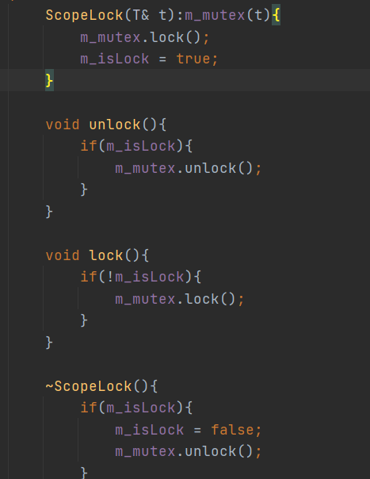

1. logger的全局初始化问题
2. macro 的函数调用栈打印问题
3. scheduler中 如果idle以协程的方式运行，而wake和idle用条件变量实现，会发现条件变量会无法被唤醒
4. 日志的无序递归打印
5. 当连接的socket数目大于进程的资源限制后，就会一直触发`Too many file`错误，因为此时accept queue 队列已经满了，accept处于可读状态，且尽管我们的事件是采用ET模式，但是我们在触发后就将事件删除掉，然后再次调用accept才再次加回来，所以就依然会触发accept的可读事件，导致accept被疯狂调用，CPU占用率100%
- 解决： 
    1).本身accept是没有问题，因为其一直都是处于可操作状态，而导致上面问题的原因，注意是没有对出错的情况进行处理
    2).利用条件变量来同步，即但出现`Too many file`错误时，就wait，阻塞，而如果有socket close 就唤醒，但是效率太低
    3). 利用一个简单的错误error_eventfd来控制同步，即如果eventfd不可读就yield出去，直到有socket close关闭后就write(eventfd)，使其可读唤醒accept协程
3).综上 这个问题，不管是ET还是LT都没法从accept函数实现上去改进。对于ET,如果每次触发仅仅触发一次，那么会漏掉很多的accept,而如果要持续accept直到其不可读，由于进程的资源限制没法取出，导致其也一直循环
        而对于LT也是一样的道理
  
6. 在测压时出现了，一个问题，就是如果连接数超过资源限制数时，那么由于有一部分连接仅仅放置在accept但没有被取出来，注意点在客户端是无法被感知的，需要增强
7. 当连接端口断开后，如果再次发送数据，那么对端会回RST报文，而内存收到RST报文后，就会会发出一个 SIGPIPE 信号，其默认处理方式是终止进程
    解决方式为：
    为了避免进程退出, 可以捕获SIGPIPE信号, 或者忽略它, 给它设置SIG_IGN信号处理函数:
    signal(SIGPIPE, SIG_IGN);
    这样, 第二次调用write方法时, 会返回-1, 同时errno置为SIGPIPE. 程序便能知道对端已经关闭.
   
   
8. socket连接时，read/recv会感知得到收到-1,并且置errno，send会触发SIGPIPE信号，若忽略该信号，则返回-1，并且置errno;

   
9. epoll_event中的data字段是共同体，不能既使用data.fd也使用data.ptr
10. 且在处理每个Fdcontext时需要加对应的锁，避免多线程修改
11. 加解锁的顺序问题（不一定需要）
    