# 压测报告

## 机器配置
服务器机器：物理内存4G,2核，硬盘20G
压测机器和运行服务器的机器是同一台

## 第一次压测，无优化
16.41K/s
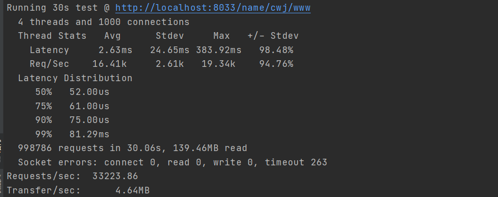
16.71K/s

17.09K/s

## 加入内存池
16.92K/s
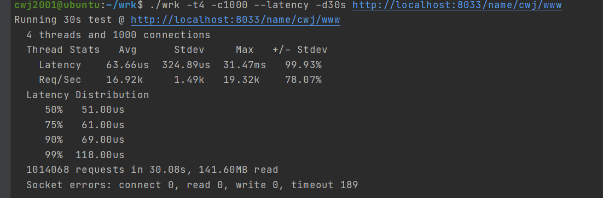
16.58K/s
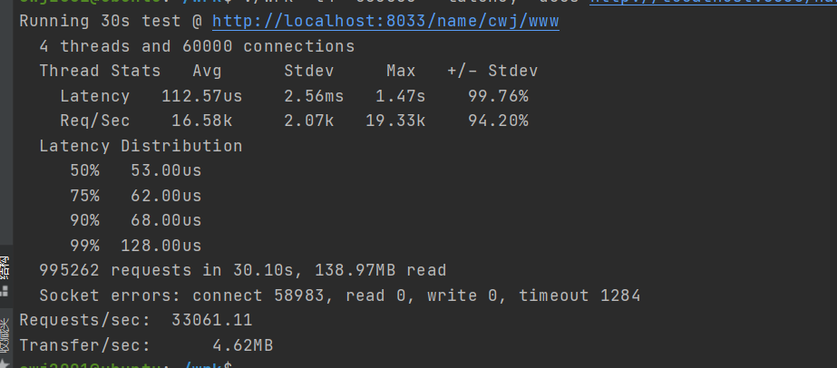
17.11K/s

## 加入协程池
21.75K/s

19.90K/s

20.51K/s

### 去掉中心协程池

21.45K/s

21.66K/s

## 加入多级并列消息队列

锁竞争减少延时降低了，但是每秒处理数减少了（后面通过加入意向机制，解决了该现象）

### 2W连接数

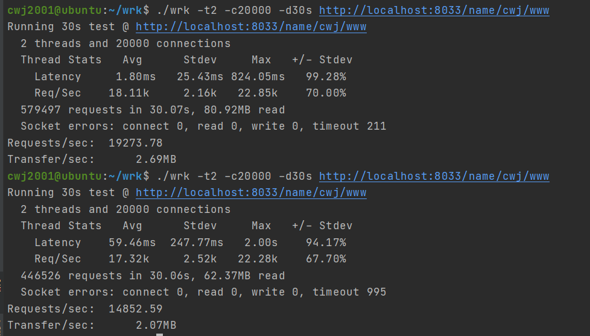
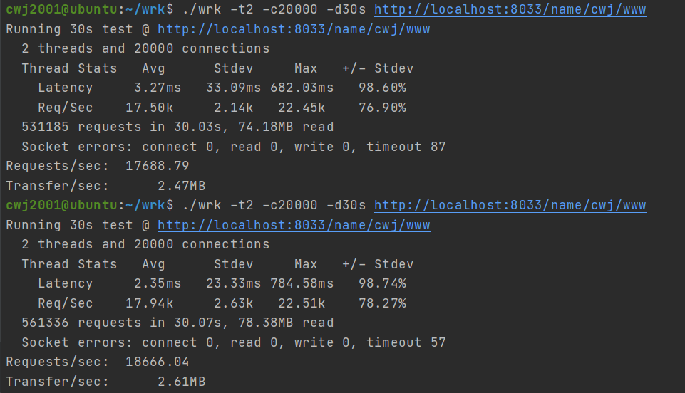

### 3W连接数

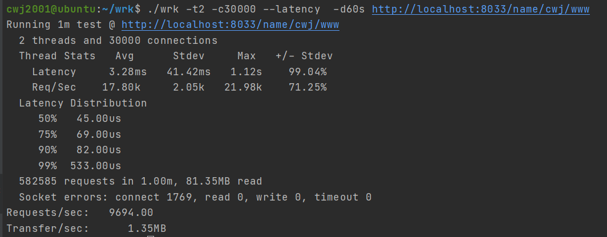
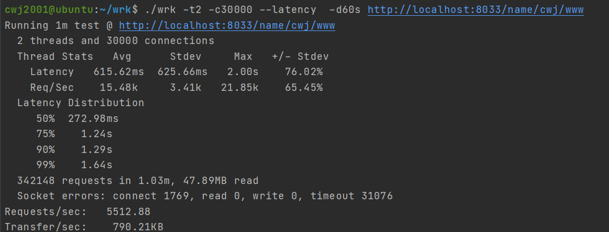

### 加入意向机制后

延时降低，qps变大

#### 2W连接数

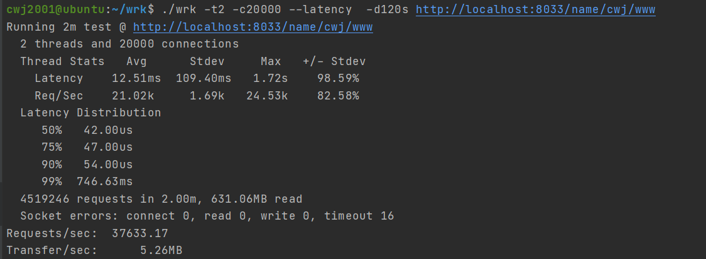
#### 3W连接数

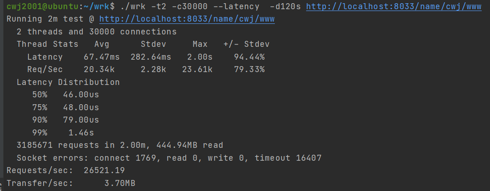
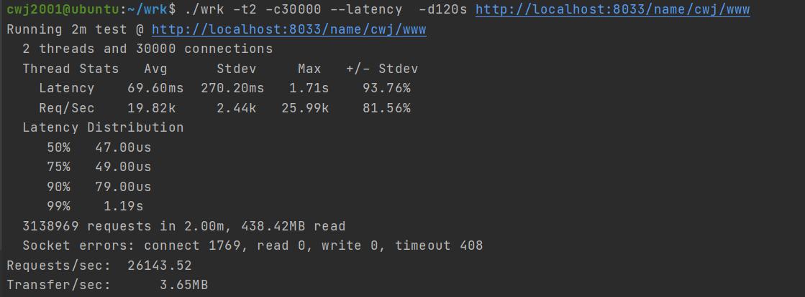

## 连接数级别测试

### 1K数

21.74K/s

### 5K数

21.51K/s

### 1W数

### 2W数

21.01k/s

20.53K/s

15.09K/s

20.19k/s

-----

**注：以下级别压测10s是没法得出结果的，因为建立连接的时间可能不止10s,且结果不是特别稳定，但是恢复2W级别以及以下，服务器均会恢复正常**

### 3W数

#### 10S无结果

#### 3w 18.09K/s

3w 18.90k/s

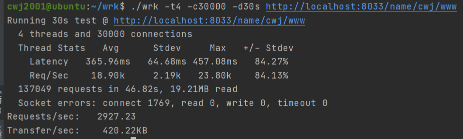

### 4W 19.11K/s

### 6W数

