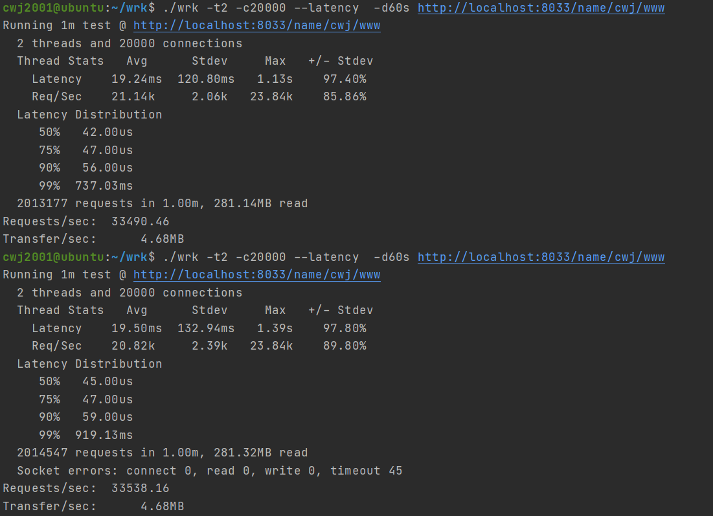
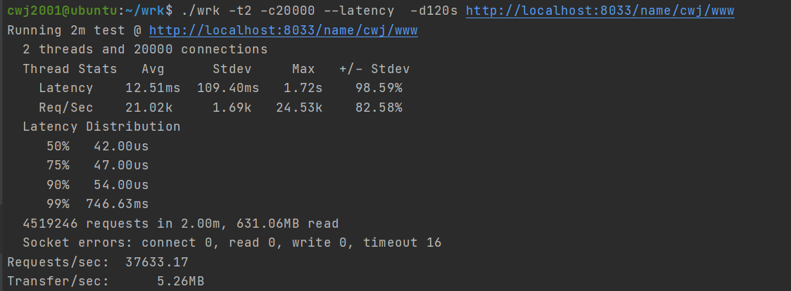
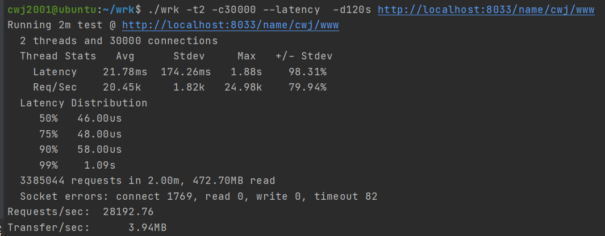

## 共享多队列机制

### 设计初衷

1. 在多线程环境下，减少单消息队列锁竞争（解决）
2. 避免线程私有队列模式下，线程卡壳，消息积压的情况 （解决）
3. 多消息队列间的负载均衡 （优化中）

### 基本思想

#### 对于调度器线程池线程而言：

每个调度器会为每个线程分配一个或是多个消息队列，每个生产者只会将任务放置到给定分配的消息队列中，避免了生产者间锁的竞争；

另外对于消费者，其默认从其预先分配的消息队列中消费任务，如果队列中没有任务，即寻找别的队列中是否有任务需要被消费

#### 对于非调度器线程而言

对于外部线程，其只能作为生产者（schedule模块设计而定的），所以其会采用轮流，或是优先级等策略方式来选择任务，具体的，其被`外部生产意向`机制控制

### 意向机制

**调度器本身线程**

- 消费优先级： 线程私有意向 > 全局消费意向
- 生产意向：预先分配的线程

**非自身线程**

由`外部生产意向`决定

**推荐意向修改原则**

当线程被被唤醒后
- 如果其本身是被任务唤醒，那么`线程私有意向`就为自身预分配的线程，且此时可以会影响`全局消费意向`
- 如果是被其他线程唤醒，且则将自己的`线程私有意向`设置为`全局消费意向`

#### 具体实现

其中生产意向机制全部实现在schedule模块中，
而消费者意向需要实现到schedule子模块中，比如（io调度子模块），如果子模块没有操作私有意向和全局意向，那么默认会每次从上一次消费的队列中寻找

### 单线程多消息队列设计(已废弃)

废弃原因：当请求多时，各个线程均有任务，消费者间竞争很少，且消费者和生产者在同一个线程，不会有锁竞争；如果是请求少，单线程多队列优势可以体现，但是此时没有必要

### 优化效果

#### 2W连接数

#### 3W连接数

